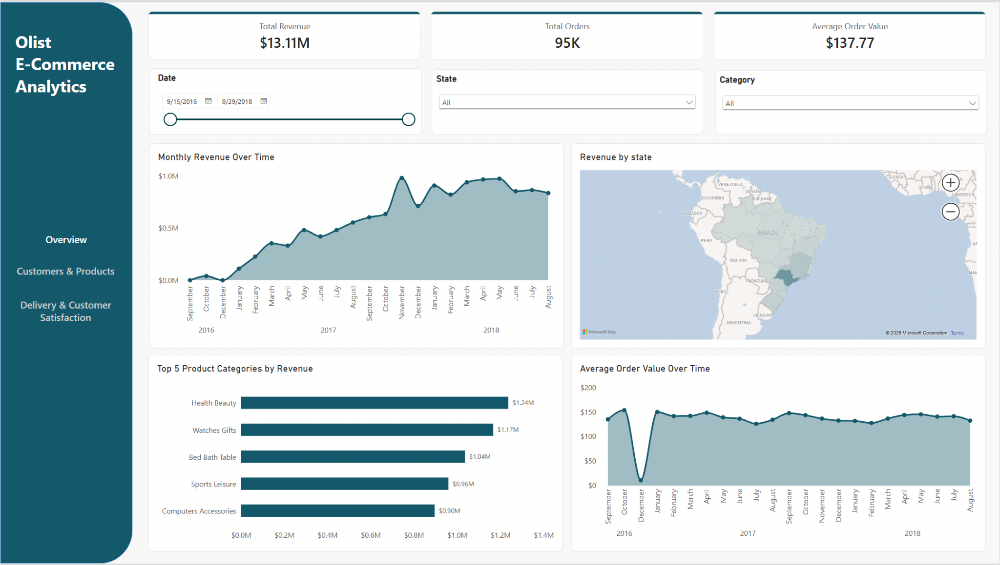
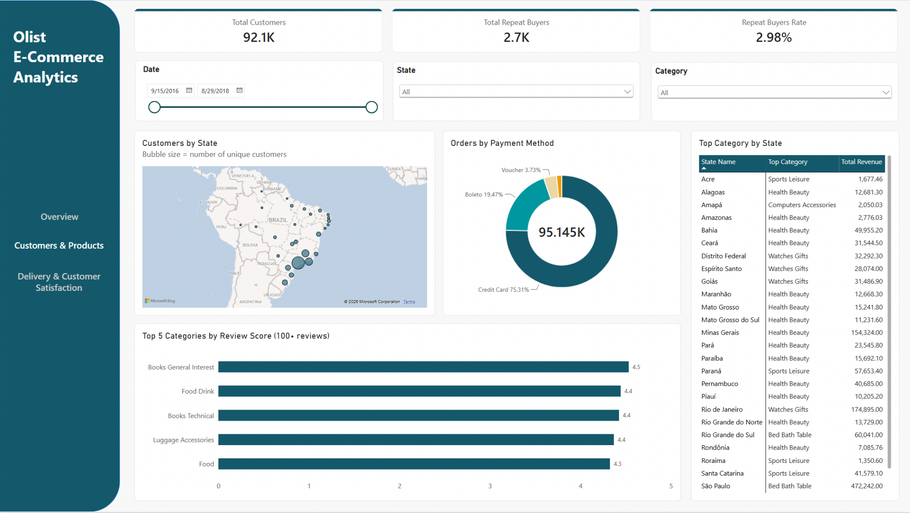
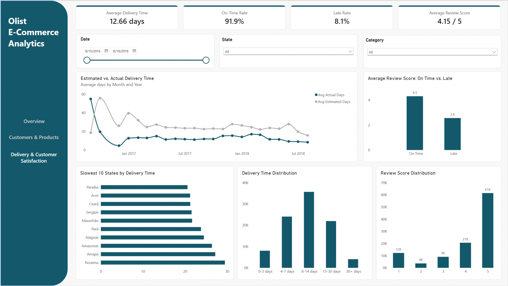

# Olist E-Commerce Analytics 🛒📊

An end-to-end data analysis project exploring the Olist Brazilian e-commerce marketplace — from data cleaning and modeling in PostgreSQL, through SQL analysis, to an interactive Power BI dashboard.

## Dashboard Preview 📈

### Sales Overview 💰



### Customers & Products 👥



### Delivery & Customer Satisfaction 🚚



---

The Power BI workbook (`dashboard.pbix`) is included in this repository.

## Overview 🔎

This project analyzes order, customer, delivery, and review data from Olist — a Brazilian e-commerce marketplace connecting small businesses to major sales channels — to understand revenue trends, delivery performance, and customer satisfaction.

Key questions explored:

- How has revenue changed over time, and which categories and states drive it?
- What's the average order value, and how has it trended?
- What percentage of customers are repeat buyers?
- How long do deliveries take, and how does actual delivery time compare to Olist's own estimates?
- What percentage of orders arrive late, and how does that affect review scores?
- How do customers pay, and what's the distribution of review scores?

---

## Tech Stack 🛠️

- **PostgreSQL** — data cleaning, relational modeling, and analytical querying
- **SQL** — typecasting, data quality checks, primary/foreign keys, CTEs, window functions, views
- **Power BI** — interactive dashboard and data visualization

---

## Project Structure 📁

```text
olist-ecommerce-analytics/
│
├── sql/
│   ├── 01_data_exploration.sql          # Initial row counts, distinct values, date ranges
│   ├── 02_data_cleaning.sql             # Typecasting, null handling, dim_states lookup table
│   ├── 03_data_quality_checks.sql       # Completeness and validity checks
│   ├── 04_relationships.sql             # Primary keys, foreign keys, indexes
│   ├── 05_analysis.sql                  # Business-question queries
│   └── 06_views.sql                     # Reusable views for the BI layer
│
├── dashboard/
│   ├── olist_ecommerce_dashboard.pbix   # Power BI workbook
│   └── screenshots/
│       ├── 01_sales_overview.png
│       ├── 02_customers_products.png
│       └── 03_delivery_satisfaction.png
│
└── README.md
```

---

## Workflow ⚙️

### 1. Data Exploration (`sql/01_data_exploration.sql`) 🔍

Initial pass over all eight raw Olist tables — row counts, distinct values (order status, payment type), and the overall date range of the dataset.

---

### 2. Data Cleaning (`sql/02_data_cleaning.sql`) 🧹

- Cast timestamp columns from text to proper `TIMESTAMP` types, handling blank strings
- Nulled out blank `product_category_name` values
- Added missing category translations not covered by the source translation table
- Built a `dim_states` lookup table (state code → full Portuguese state name) used throughout the analysis and the map visuals

---

### 3. Data Quality Checks (`sql/03_data_quality_checks.sql`) ✅

- **Completeness:** null counts across orders, products, order items, and payments (e.g. ~1.85% of products are missing a category)
- **Validity:** negative prices/freight, invalid product dimensions, out-of-range review scores, impossible date orderings (e.g. delivered before purchased)

---

### 4. Relationships (`sql/04_relationships.sql`) 🔗

Primary keys, foreign keys, and indexes across all eight raw tables to enforce and document the relational model connecting orders, customers, products, sellers, payments, and reviews.

---

### 5. SQL Analysis (`sql/05_analysis.sql`) 💻

Queries organized by theme — **sales, customers, delivery, reviews, payments** — answering each business question above.

Techniques used:

- Aggregations and `GROUP BY`
- CTEs
- Window functions (`RANK()` for top category per state)
- Date truncation and formatting for time-series trends

---

### 6. Views (`sql/06_views.sql`) 🗂️

Consolidates the analysis into reusable views for the BI layer:

- `order_facts` — one row per order item, joined with customer, product, category, and review data; the main fact table behind most dashboard visuals
- `delivery_time_buckets` — delivery times grouped into ranges (0–3, 4–7, 8–14, 15–30, 30+ days)
- `state_geo` — average latitude/longitude per state, used for the map visuals
- `top_category_by_state` — top revenue-generating category per state

**Note:** all revenue, delivery, and review analysis is filtered to `order_status = 'delivered'`, so cancelled and unavailable orders are excluded from every metric.

---

# Key Findings 📌

- **Late deliveries tank satisfaction:** orders delivered on time average a **4.3** review score vs. **2.6** for late orders — the single strongest driver of review score in the data.
- **Delivery times improved sharply:** actual delivery time dropped from late 2016 into 2017 and has stayed relatively flat since, while Olist's estimated delivery windows stayed roughly constant — meaning actual performance has consistently beaten the estimate.
- **Repeat purchases are rare:** only around **3%** of unique customers place more than one order, typical for a marketplace where sellers — not Olist — own the customer relationship.
- **Revenue is geographically concentrated:** São Paulo, Rio de Janeiro, and Minas Gerais account for a disproportionate share of both customers and revenue, consistent with Brazil's population distribution.
- **Health & Beauty, Watches & Gifts, and Bed Bath & Table** are consistently the top revenue categories nationally.

---

## Skills Demonstrated 🎯

- Data cleaning and typecasting
- Relational data modeling (PK/FK, indexing)
- Data quality auditing
- SQL analytics (CTEs, window functions, views)
- Dashboard development
- Business insight generation

---

## Data Source 📚

Order, customer, product, seller, payment, and review data sourced from the [Olist Brazilian E-Commerce dataset](https://www.kaggle.com/datasets/olistbr/brazilian-ecommerce) on Kaggle.
